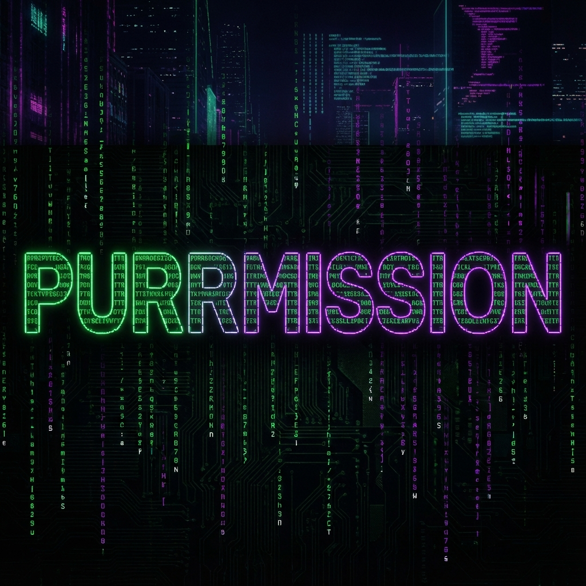
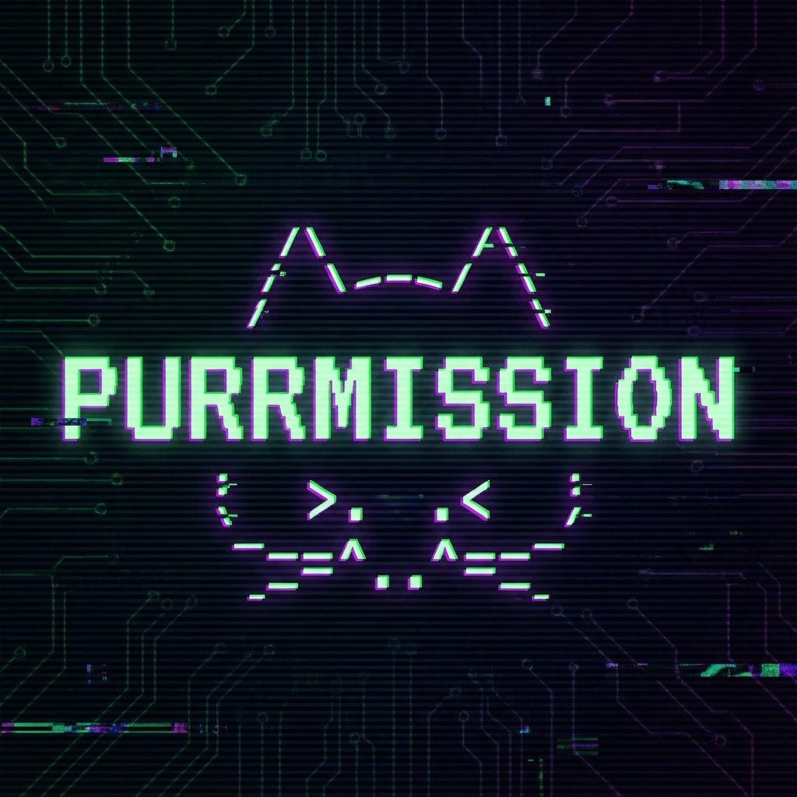

# 🐱 Purrmission 

> **Discord-based multi-user approval gate** – An "Authy-clone" for shared accounts (e.g., `shared-account@example.com`), with an HTTP API for external services to request approvals.

## Key Features

- **Shared 2FA / TOTP**: Maintain a centralized vault of 2FA secrets for team accounts (GitHub, AWS, etc.).
- **Approval Chains**: Require guardian approval for protected resource usage.
- **Discord Integration**: Get codes and approve requests directly in DMs or channels.
- **HTTP API**: External services can request approvals via RESTful endpoints.
- **Pluggable Storage**: In-memory repositories with future support for databases.

## Sponsorship & Licensing

This project is classified under the **Purrfect Universe Licensing Directive** as:

**🟧 Company-Supported Personal IP (CSP-IP)**  
A category for employee-created projects that are:

* Built by the employee as their personal intellectual property
* Actively supported, enhanced, or resourced by **Purrfect Software Limited**
* Strategically aligned with the broader **Purrfect Universe** ecosystem
* Recognized as dual-heritage work belonging to the creator and the company

Under this classification:

* **Primary Author:** Project Contributors — Original creators & maintainers
* **Strategic Stewardship:** Universe Architect & PU Founder
* **Support:** **Purrfect Software Limited** — Engineering, DevOps & Infrastructure
* **Usage Rights:** Community-friendly, zero-penalty experimentation encouraged
* **Disclosure:** Reuse, forks, or derivative tools should mention this CSP-IP origin

This ensures the project remains open, resilient, supported, and future-proof while preserving individual authorship and PU-aligned governance.

## How It Works


1. **External services** send approval requests via HTTP API
2. **Guardians** (trusted users) receive approval requests in Discord
3. **Approvals/Denials** are recorded and optionally reported back via callback URL

### Architecture

```
┌─────────────────┐     HTTP POST      ┌──────────────────────┐
│ External Service│ ─────────────────► │   Purrmission Bot    │
└─────────────────┘  /api/requests     │  (Discord + Fastify) │
                                       └──────────┬───────────┘
                                                  │
                                                  │ Discord Message
                                                  ▼
                                       ┌──────────────────────┐
                                       │   Discord Guardians  │
                                       │   [Approve] [Deny]   │
                                       └──────────────────────┘
```

### Key Concepts

- **Resource**: A protected account or service requiring approval (e.g., a shared email)
- **Guardian**: A Discord user who can approve/deny requests for a resource
- **TOTP Account**: A stored 2FA credential that generates time-based codes


## Setup

### Prerequisites

- Node.js v24.10.1 (use `nvm use` if you have nvm)
- PNPM enabled (`corepack enable && corepack prepare pnpm@latest --activate`)
- A Discord bot token ([Discord Developer Portal](https://discord.com/developers/applications))

### Installation

```bash
# 1. Use the correct Node version
nvm use 24.10.1

# 2. Enable PNPM
corepack enable
corepack prepare pnpm@latest --activate

# 3. Install dependencies
pnpm install

# 4. Configure environment
cp apps/purrmission-bot/.env.example apps/purrmission-bot/.env
# Edit .env with your Discord credentials

# 5. Generate Prisma Client
pnpm prisma:generate

# 6. Deploy Discord slash commands
pnpm discord:deploy-commands

# 7. Start the bot
pnpm dev:purrmission
```

### 🔐 2FA Cheatsheet

| Action | Command |
| :--- | :--- |
| **Add Account** | `/purrmission 2fa add account:"..." mode:uri uri:...` |
| **List Accounts** | `/purrmission 2fa list [shared:True]` |
| **Get Code** | `/purrmission 2fa get account:"..."` |
| **Update Key** | `/purrmission 2fa update account:"..." backup_key:"..."` |


### Environment Variables

| Variable            | Description                                     |
| ------------------- | ----------------------------------------------- |
| `DISCORD_BOT_TOKEN` | Your Discord bot token                          |
| `DISCORD_CLIENT_ID` | Your Discord application client ID              |
| `DISCORD_GUILD_ID`  | Guild ID for development (commands deploy here) |
| `APP_PORT`          | HTTP server port (default: 3000)                |
| `DATABASE_URL`      | Database connection URL (e.g., SQLite file path) |
| `ENCRYPTION_KEY`    | **Required** - 32-byte hex string (64 chars) for encrypting TOTP secrets and resource fields at rest. Generate with: `node -e "console.log(require('crypto').randomBytes(32).toString('hex'))"` |

### Migration for Existing Installations

If you're upgrading from a version that stored TOTP secrets in plaintext, run the migration script to encrypt existing secrets:

```bash
# Dry run (recommended first)
ENCRYPTION_KEY=<your-key> tsx scripts/encrypt-totp-secrets.ts

# Apply changes
ENCRYPTION_KEY=<your-key> tsx scripts/encrypt-totp-secrets.ts --apply
```

The script will:
- Detect which secrets are already encrypted
- Encrypt any plaintext secrets found
- Validate encryption/decryption before committing changes
- Provide a detailed summary of changes

## Usage

### 1. Register a Resource

Use the Discord slash command:

```
/purrmission-register-resource name:My Shared Account
```

This will:

- Create a new protected resource
- Generate an API key (save this!)
- Set you as the owner/guardian

### 2. Add Guardians

```
/purrmission-add-guardian resource-id:<resource-id> user:@someone
```

### 3. Request Approval (External Service)

Send an HTTP POST request to create an approval request:

```bash
curl -X POST http://localhost:3000/api/requests \
  -H "Content-Type: application/json" \
  -d '{
    "resourceId": "YOUR_RESOURCE_ID",
    "apiKey": "YOUR_API_KEY",
    "context": {
      "action": "login",
      "ip": "192.168.1.1",
      "from": "web-app"
    },
    "callbackUrl": "https://your-service.com/webhook/approval"
  }'
```

Response:

```json
{
  "requestId": "abc123-...",
  "status": "PENDING",
  "resourceId": "def456-...",
  "resourceName": "My Shared Account"
}
```

### 4. Check Request Status

```bash
curl http://localhost:3000/api/requests/{requestId}
```

### 5. Health Check

```bash
curl http://localhost:3000/health
```

## Development

### Project Structure

```
purrmission/
├── apps/
│   └── purrmission-bot/
│       ├── src/
│       │   ├── index.ts              # Entry point
│       │   ├── config/env.ts         # Environment config
│       │   ├── logging/logger.ts     # Logger utility
│       │   ├── domain/
│       │   │   ├── models.ts         # Type definitions
│       │   │   ├── repositories.ts   # Data access layer
│       │   │   └── services.ts       # Business logic
│       │   ├── discord/
│       │   │   ├── client.ts         # Discord.js client
│       │   │   ├── commands/         # Slash commands
│       │   │   └── interactions/     # Button handlers
│       │   └── http/
│       │       └── server.ts         # Fastify HTTP API
│       ├── package.json
│       └── tsconfig.json
├── package.json                      # Workspace root
├── tsconfig.base.json               # Shared TS config
└── README.md
```

### Scripts

| Command                        | Description                          |
| ------------------------------ | ------------------------------------ |
| Command                        | Description                                  |
| ------------------------------ | -------------------------------------------- |
| `pnpm dev:purrmission`         | Start bot in development mode (via Turbo)    |
| `pnpm build`                   | Build workspace (via Turbo)                  |
| `pnpm lint`                    | Run ESLint                                   |
| `pnpm format`                  | Format code with Prettier                    |
| `pnpm discord:deploy-commands` | Register slash commands with Discord         |
| `pnpm prisma:generate`         | Generate Prisma Client                       |

## MVP Limitations

This is a scaffold/MVP with the following limitations:

- **In-memory storage**: All data is lost on restart. TODO: Add Postgres/Prisma.
- **No authentication for owner operations**: Anyone can add guardians. TODO: Enforce owner-only.
- **No callback implementation**: Callback URLs are logged but not called. TODO: Implement HTTP callbacks.
- **Single channel/DM**: Messages go to guardian DMs. TODO: Configurable notification channels.

## Deployment

For production deployment instructions, server requirements, and GitHub Actions configuration, see the [Deployment Guide](DEPLOY.md).

## Further Reading

- [Purrmission 2FA Guide](docs/purrmission-2fa.md)
- [Deployment Guide](DEPLOY.md)
- [Agent Instructions](.agent/rules/README.md)


## License

MIT

### 🛡️ ICARO-42/B ORDINANCE — COMPLIANCE NOTICE

This project is distributed under the MIT License — designed for maximum freedom, remixability, and interstellar interoperability.

Under the Interstellar Code Appropriation & Redistribution Ordinance (ICARO-42/B),
reuse, modification, and redistribution are fully permitted. Creative divergence is
not a violation — it is an expected evolutionary pathway.

If your fork, derivative, or remix contributes something meaningful to any corner
of the universe, a small nod of acknowledgment helps maintain cosmic symmetry.
Not required. Always appreciated.

---

Built with 🐱 by the Purrmission team
