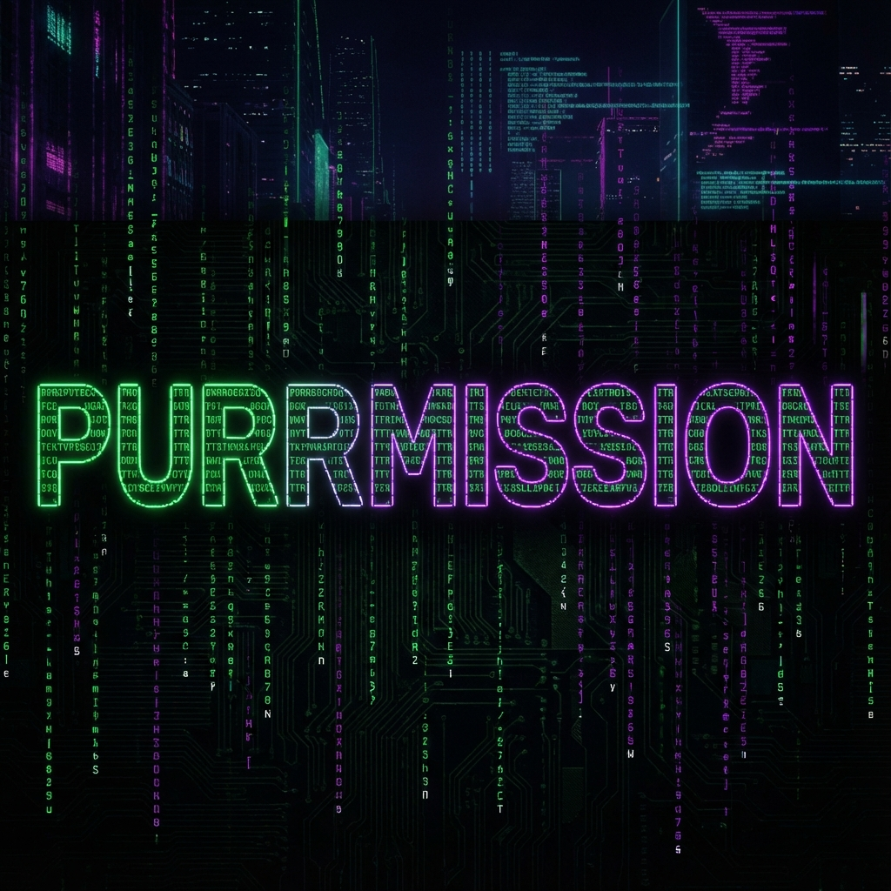
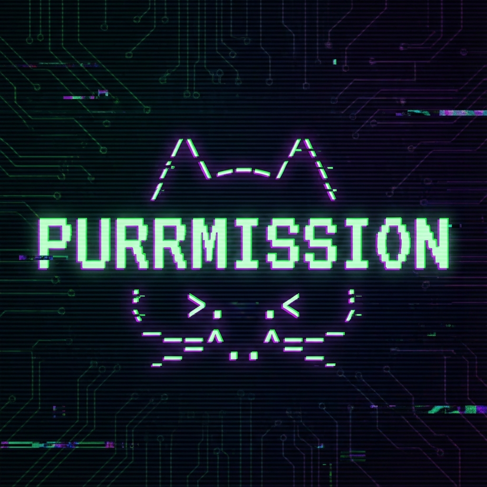

# 🐱 Purrmission 

> **Discord-based multi-user approval gate** – Secure credential sync for teams, shared 2FA management, and approval workflows.

## Key Features

- **Credential Sync (Pawthy CLI)**: Securely sync environment variables between local dev and central store
- **Shared 2FA / TOTP**: Centralized vault of 2FA secrets for team accounts (GitHub, AWS, etc.)
- **Approval Chains**: Guardian-based approval for protected resource access
- **Discord Integration**: Get codes and approve requests directly in DMs
- **HTTP API**: RESTful endpoints for external service integrations
- **Persistent Storage**: Prisma ORM with SQLite (migratable to PostgreSQL)
- **At-Rest Encryption**: AES-256-GCM encryption for secrets and TOTP credentials

---

## Quick Start

### For Developers (Credential Sync)

Use the **Pawthy CLI** to sync secrets with your team:

```bash
# Install CLI
npm install -g @psl-oss/pawthy

# Authenticate via Discord
pawthy login

# Link to your project
pawthy init

# Pull secrets (may require guardian approval)
pawthy pull
```

See [Pawthy CLI Documentation](apps/pawthy/README.md) for full usage.

---

## Codex IDE

This repo now includes a Codex-native setup:

- `AGENTS.md` files give Codex project and package-specific instructions.
- `pnpm mcp:sync` generates `.codex/config.toml` for project-scoped Codex MCP wiring.
- `pnpm mcp:sync` also keeps this repo trusted in `~/.codex/config.toml` so Codex is allowed to load the generated project config.
- The generated Codex config uses Codex's native `command` / `args` / `cwd` / `env` settings, resolved from `mcp.json`, optional `mcp.local.json`, and the repo-root `.env`.

This is additive to the existing Antigravity, Claude Desktop, and VS Code flows. `mcp.json` stays the shared source of truth, and `scripts/sync-mcp.cjs` / `pnpm mcp:sync` continue to support the other MCP-aware clients.

Codex follows the same tooling convention as the other agent platforms here: run `pnpm mcp:sync`, then open or re-open the repo in Codex.

If `GITHUB_PERSONAL_ACCESS_TOKEN` is present in your local `.env`, the generated Codex config will also enable the GitHub MCP server automatically.

Optional MCP-related environment variables:

| Variable                       | Description                                                      |
| ------------------------------ | ---------------------------------------------------------------- |
| `CONTEXT7_API_KEY`             | Optional API key for Context7 MCP                                |
| `GITHUB_PERSONAL_ACCESS_TOKEN` | Optional GitHub token for enabling the GitHub MCP server locally |

To verify the setup:

```bash
pnpm mcp:sync
codex "Show which instruction files are active for this repo."
```

---

## How It Works

### Credential Sync Flow

```
┌─────────────────┐     pawthy pull      ┌──────────────────────┐
│   Developer     │ ─────────────────►   │   Purrmission Bot    │
│   (CLI)         │                      │  (Discord + Fastify) │
└─────────────────┘                      └──────────┬───────────┘
                                                    │
                                         ┌──────────▼───────────┐
                                         │  Guardian Approval?  │
                                         │   [Approve] [Deny]   │
                                         └──────────┬───────────┘
                                                    │
                                         ┌──────────▼───────────┐
                                         │   Secrets Returned   │
                                         │   → .env file        │
                                         └──────────────────────┘
```

### Key Concepts

| Concept         | Description                                          |
| --------------- | ---------------------------------------------------- |
| **Project**     | A collection of environments (e.g., "my-app")        |
| **Environment** | A set of secrets (e.g., Production, Staging)         |
| **Resource**    | The underlying protected entity with access controls |
| **Guardian**    | Discord user who can approve/deny access requests    |
| **Owner**       | Project creator with full control                    |

---

## Discord Commands

### 2FA Management

| Action        | Command                                                                 |
| ------------- | ----------------------------------------------------------------------- |
| Add Account   | `/purrmission 2fa add account:"..." mode:uri` (then enter URI in modal) |
| List Accounts | `/purrmission 2fa list [shared:True]`                                   |
| Get Code      | `/purrmission 2fa get account:"..."`                                    |
| Update Key    | `/purrmission 2fa update account:"..." backup_key:"..."`                |

### Guardian Management

| Action          | Command                                                       |
| --------------- | ------------------------------------------------------------- |
| Add Guardian    | `/purrmission guardian add resource-id:<id> user:@someone`    |
| Remove Guardian | `/purrmission guardian remove resource-id:<id> user:@someone` |
| List Guardians  | `/purrmission guardian list resource-id:<id>`                 |

### CLI Login

| Action            | Command                                 |
| ----------------- | --------------------------------------- |
| Approve CLI Login | `/purrmission cli-login code:XXXX-XXXX` |

---

## Server Setup

### Prerequisites

- Node.js v24.10.1 (use `nvm use` if you have nvm)
- PNPM enabled (`corepack enable && corepack prepare pnpm@latest --activate`)
- A Discord bot token ([Discord Developer Portal](https://discord.com/developers/applications))

### Installation

```bash
# 1. Use the correct Node version
nvm use

# 2. Enable PNPM
corepack enable

# 3. Install dependencies
pnpm install

# 4. Configure environment
cp .env.example .env
# Edit .env with your credentials

# 5. Generate Prisma Client & deploy migrations
pnpm prisma:generate
pnpm prisma:deploy

# 6. Deploy Discord slash commands
pnpm discord:deploy-commands

# 7. Start the bot
pnpm dev:purrmission
```

### Environment Variables

| Variable                       | Description                                              |
| ------------------------------ | -------------------------------------------------------- |
| `DISCORD_BOT_TOKEN`            | Your Discord bot token                                   |
| `DISCORD_CLIENT_ID`            | Your Discord application client ID                       |
| `DISCORD_GUILD_ID`             | Guild ID for development (commands deploy here)          |
| `APP_PORT`                     | HTTP server port (default: 3001)                         |
| `DATABASE_URL`                 | Database URL (e.g., `file:./data/prod.db`)               |
| `ENCRYPTION_KEY`               | **Required** - 32-byte hex for at-rest encryption        |
| `EXTERNAL_API_URL`             | Public API URL (e.g., `https://purrmission.example.com`) |
| `CONTEXT7_API_KEY`             | Optional - API key for Context7 MCP                      |
| `GITHUB_PERSONAL_ACCESS_TOKEN` | Optional - token for GitHub MCP tooling                  |

Generate an encryption key:

```bash
node -e "console.log(require('crypto').randomBytes(32).toString('hex'))"
```

---

## HTTP API

### Health Check

```bash
curl https://your-server.com/health
```

### Request Approval (External Service)

```bash
curl -X POST https://your-server.com/api/requests \
  -H "Content-Type: application/json" \
  -d '{
    "resourceId": "YOUR_RESOURCE_ID",
    "apiKey": "YOUR_API_KEY",
    "context": {
      "action": "login",
      "ip": "192.168.1.1"
    },
    "callbackUrl": "https://your-service.com/webhook"
  }'
```

### Check Request Status

```bash
curl https://your-server.com/api/requests/{requestId}
```

---

## Development

### Project Structure

```
purrmission/
├── apps/
│   ├── purrmission-bot/     # Discord bot + HTTP API
│   │   ├── src/
│   │   │   ├── domain/      # Business logic & models
│   │   │   ├── discord/     # Commands & interactions
│   │   │   └── http/        # Fastify API server
│   │   └── package.json
│   └── pawthy/              # CLI tool
│       ├── src/             # Command implementations
│       └── package.json
├── prisma/                  # Database schema & migrations
├── package.json             # Workspace root
└── README.md
```

### Scripts

| Command                        | Description                   |
| ------------------------------ | ----------------------------- |
| `pnpm dev:purrmission`         | Start bot in development mode |
| `pnpm build`                   | Build all packages            |
| `pnpm test`                    | Run tests                     |
| `pnpm lint`                    | Run ESLint                    |
| `pnpm format`                  | Format code with Prettier     |
| `pnpm discord:deploy-commands` | Register slash commands       |
| `pnpm prisma:generate`         | Generate Prisma Client        |
| `pnpm prisma:deploy`           | Apply database migrations     |
| `pnpm prisma:studio`           | Open Prisma Studio            |

---

## Deployment

For production deployment instructions, see the [Deployment Guide](DEPLOY.md).

---

## Sponsorship & Licensing

This project is classified under the **Purrfect Universe Licensing Directive** as:

**🟧 Company-Supported Personal IP (CSP-IP)**  
A category for employee-created projects that are:

- Built by the employee as their personal intellectual property
- Actively supported by **Purrfect Software Limited**
- Strategically aligned with the **Purrfect Universe** ecosystem

Under this classification:

- **Primary Author:** Project Contributors
- **Support:** **Purrfect Software Limited** — Engineering, DevOps & Infrastructure
- **Usage Rights:** Community-friendly, zero-penalty experimentation encouraged

---

## Further Reading

- [Pawthy CLI Documentation](apps/pawthy/README.md)
- [Deployment Guide](DEPLOY.md)
- [2FA Guide](docs/purrmission-2fa.md)

---

## License

MIT

### 🛡️ ICARO-42/B ORDINANCE — COMPLIANCE NOTICE

This project is distributed under the MIT License — designed for maximum freedom and interoperability.

Under the Interstellar Code Appropriation & Redistribution Ordinance (ICARO-42/B),
reuse, modification, and redistribution are fully permitted.

---

Built with 🐱 by the Purrmission team
