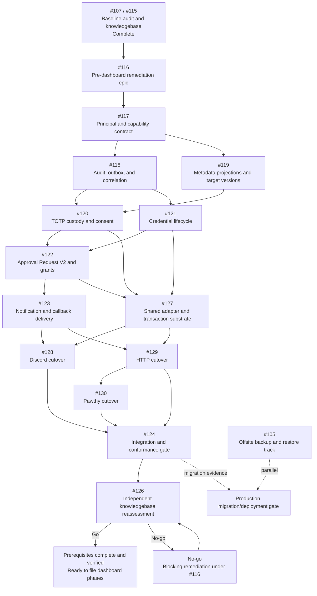

# Pre-Dashboard RBAC Prerequisite Execution Graph

- Status: Active execution guide
- Epic: [#116](https://github.com/kuasha420/purrmission/issues/116)
- Baseline specification:
  [RBAC and Observability Knowledgebase](../design/rbac-dashboard-knowledgebase.md)
- Baseline delivery: [#107](https://github.com/kuasha420/purrmission/issues/107) /
  [#115](https://github.com/kuasha420/purrmission/pull/115)
- Final readiness gate: [#126](https://github.com/kuasha420/purrmission/issues/126)
- Last assessed: 2026-07-24

## 1. Goal and authority

This graph coordinates all work required to make the existing Discord, Fastify, Pawthy, domain,
persistence, credential, approval, TOTP, audit, and delivery implementations conform to one
least-privilege contract before Web Dashboard phases are defined.

The endpoint is not merely "all implementation PRs merged." The endpoint is:

1. every prerequisite issue merged and post-merge verified;
2. the cross-surface integration gate passed;
3. an independent reviewer reassessed a pinned `master` commit against every
   `PREREQUISITE`-classified knowledgebase requirement;
4. the knowledgebase was updated with the verified revision and evidence; and
5. [#126](https://github.com/kuasha420/purrmission/issues/126) recorded **Go** for filing the next
   Discord OAuth/session and Web Dashboard backend/frontend phase issues.

Authority is ordered as follows:

1. The knowledgebase owns normative authorization and observability behavior.
2. Each issue owns its named contract and acceptance criteria.
3. This document owns sequencing, pickup, merge, verification, and handoff rules.
4. GitHub's native parent/sub-issue and `blocked by` relationships mirror the executable graph.

If these sources conflict, stop the affected implementation, record the conflict on the contract
owner's issue, and resolve the specification before a dependent PR merges. Do not silently weaken
the knowledgebase to match an implementation.

### 1.1 Phase boundary

The knowledgebase classifies requirements as `PREREQUISITE`, `OAUTH_SESSION`,
`DASHBOARD_BACKEND`, or `DASHBOARD_UI`. This graph implements and certifies only the
`PREREQUISITE` class plus current Discord, HTTP, Pawthy, domain, persistence, audit, and worker
surfaces.

#126 must confirm that later-phase requirements remain coherent and explicitly deferred, but it
must not demand OAuth endpoints, browser sessions, dashboard routes, or UI evidence before it can
record Go. Reclassification requires a reviewed knowledgebase change; an implementation issue
cannot relabel a failed prerequisite as future work.

## 2. Executable dependency graph



The native GitHub dependencies are the machine-readable scheduling source. The Mermaid graph is
their documented view.

[#105](https://github.com/kuasha420/purrmission/issues/105) runs in parallel. It blocks production
schema migration/deployment, not local implementation or code-level planning readiness. If it is
incomplete at final reassessment, #126 must preserve an explicit production rollout block.

## 3. Chronological execution waves

| Wave | Work                                                                                                                        | Ready when                                                    | Parallelism and exit                                                                                    |
| ---- | --------------------------------------------------------------------------------------------------------------------------- | ------------------------------------------------------------- | ------------------------------------------------------------------------------------------------------- |
| 0    | #107/#115 baseline and #116 orchestration                                                                                   | Complete                                                      | No implementation starts without the knowledgebase and this graph.                                      |
| 1    | [#117](https://github.com/kuasha420/purrmission/issues/117)                                                                 | Baseline accepted                                             | Runs alone. Exit freezes principal, capability, ownership, and Guardian invariants.                     |
| 2    | [#118](https://github.com/kuasha420/purrmission/issues/118) and [#119](https://github.com/kuasha420/purrmission/issues/119) | #117 verified and closed                                      | Develop in parallel. Audit/outbox and metadata/version contracts must remain independently owned.       |
| 3    | [#120](https://github.com/kuasha420/purrmission/issues/120) and [#121](https://github.com/kuasha420/purrmission/issues/121) | Their native blockers are verified and closed                 | Develop in parallel. #120 owns custody/consent; #121 owns credentials.                                  |
| 4    | [#122](https://github.com/kuasha420/purrmission/issues/122)                                                                 | #120 and #121 verified and closed                             | Approval V2 is the only owner of grant decision, issuance, and consumption.                             |
| 5    | [#123](https://github.com/kuasha420/purrmission/issues/123) and [#127](https://github.com/kuasha420/purrmission/issues/127) | #122 verified; all native blockers closed                     | Delivery and shared adapter/transaction substrate develop in parallel.                                  |
| 6    | [#128](https://github.com/kuasha420/purrmission/issues/128) and [#129](https://github.com/kuasha420/purrmission/issues/129) | #123 and #127 verified and closed                             | Discord and HTTP cutovers develop in parallel. HTTP freezes the Pawthy-facing contract.                 |
| 7    | [#130](https://github.com/kuasha420/purrmission/issues/130)                                                                 | #129 verified and closed                                      | Pawthy may plan against #127 earlier, but it merges only against the verified HTTP contract.            |
| 8    | [#124](https://github.com/kuasha420/purrmission/issues/124)                                                                 | #128, #129, and #130 verified and closed                      | Integrates surfaces, removes legacy paths, and runs the complete conformance suite.                     |
| 9    | [#126](https://github.com/kuasha420/purrmission/issues/126)                                                                 | #117-#124 and #127-#130 verified and closed; contracts frozen | Independent holistic reassessment. Go updates the knowledgebase; No-go returns work to the owning node. |

Research, threat modeling, test design, and file-collision planning may begin one wave early.
Production implementation must not merge before every native blocker is **Verified** and closed.

The logical critical path is:

`#117 -> #118/#119 -> #120/#121 -> #122 -> #123/#127 -> #129 -> #130 -> #124 -> #126`

Capacity should protect the critical path first. A parallel lane must not consume the only reviewer
or migration owner needed to unblock the next join.

## 4. Contract ownership

| Owner | Sole authority during this epic                                                                        |
| ----- | ------------------------------------------------------------------------------------------------------ |
| #117  | `Principal`, capability names, evaluator results/reasons, ownership, and Guardian invariants           |
| #118  | Audit envelope, correlation, redaction, outbox, idempotency, and fail-closed audit boundary            |
| #119  | Metadata DTOs/projections, accessible discovery, and target/policy version semantics                   |
| #120  | TOTP custody, link/delegation consent inputs, links, revocation, metadata, direct reveal, and recovery |
| #121  | Resource/service/Pawthy/device credential issuance, digest, scope, rotation, expiry, and revoke        |
| #122  | Approval request state machine, immutable grants, decision, issuance, and atomic consumption           |
| #123  | Delivery destinations, retries, Discord delivery state, callback signing, and SSRF protection          |
| #127  | Shared adapter ports/DTOs/errors, secret batch transaction, and Environment/Resource transaction       |
| #128  | Discord command, autocomplete, button, and interaction adaptation                                      |
| #129  | Fastify routes, HTTP transport semantics, schemas, and the Pawthy-facing server contract               |
| #130  | Pawthy login/init/push/pull behavior and CLI compatibility                                             |
| #124  | Cross-surface integration, legacy-path removal, and final conformance suite                            |
| #126  | Independent evidence review, Go/No-go, and knowledgebase completion update                             |

Sibling issues consume owned contracts; they do not redefine them. A necessary cross-owner change
must be proposed on the owning issue and merged there first. In particular:

- #120 records the one-time link consent, persistent delegation envelope, and per-grant delegation
  consent inputs; #122 alone creates or consumes grants.
- #123 transports authorized outcomes; it never grants access.
- #127 exposes existing policy through use cases; it does not add policy.
- #124 fixes integration defects; it does not absorb incomplete child acceptance criteria.
- #126 certifies evidence; it does not edit the knowledgebase to excuse a P0/P1 implementation gap.

## 5. Issue state and pickup protocol

Use this state machine in issue comments and team coordination:

`Blocked -> Ready -> Claimed -> In review -> Merged -> Verified -> Closed`

`Merged` is deliberately not `Verified`.

### 5.1 Ready gate

An issue is Ready only when:

- every incoming native dependency is post-merge verified and closed;
- its acceptance criteria, threat/failure cases, affected surfaces, and test obligations are clear;
- any knowledgebase contradiction has been resolved by the contract owner;
- collision-prone files and schema ownership are identified;
- migrations include forward, compatibility, data-reconciliation, rollback/restore, and failure plans;
- an independent reviewer is available for P0/security-sensitive work; and
- the implementer can branch from the latest verified `master`.

### 5.2 Claim template

Assign the issue and post:

```md
Execution graph state: Claimed
Owner:
Reviewer / security reviewer:
Branch / worktree:
Base master SHA:
Verified upstream issues and SHAs:
Contracts consumed:
Contracts changed:
Expected files and surfaces:
Schema or migration ownership:
Planned PR count:
Known overlap or blocker:
```

One implementer or agent should own one implementation issue at a time. Multiple agents may help
with bounded research, tests, or review, but one owner remains accountable for contract coherence
and handoff.

### 5.3 Branch and worktree rules

- Keep the primary checkout on `master` for integration and post-merge verification.
- Use one branch and one worktree per active issue. Never let two humans or agents edit the same
  worktree.
- Suggested names are `feat/issue-117-capability-contract`,
  `fix/issue-121-credential-lifecycle`, and `docs/issue-126-readiness-signoff`.
- Branch from the latest verified `master`, not from a sibling feature branch.
- Avoid stacked PRs. If design work must begin early, keep it rebased and do not merge it before
  native blockers close.
- Use merge commits for this epic so issue and dependency boundaries remain visible.
- Prefer `Refs #NNN` in the PR. Close the issue only after post-merge verification, rather than
  letting merge-time automation equate merge with completion.

## 6. Parallel work and collision control

Parallel development is allowed only where the graph forks. Parallel merges remain serialized.

High-collision areas require these rules:

| Area                                            | Rule                                                                                                                                         |
| ----------------------------------------------- | -------------------------------------------------------------------------------------------------------------------------------------------- |
| `prisma/schema.prisma` and migrations           | One schema integration lock. The later PR rebases on current `master`, reconciles migration order, and reruns fresh plus upgrade rehearsals. |
| Principal/capability types and policy           | #117 merges contract changes before consumers. Consumers do not fork capability names.                                                       |
| Audit/outbox and transaction APIs               | #118 owns primitives; #127 composes them but does not create a competing outbox.                                                             |
| TOTP and Approval V2                            | #120 owns link/delegation consent inputs and versions; #122 owns grants. Cross-boundary tests are reviewed by both owners.                   |
| `approvalButtons.ts` and Discord delivery       | #123 owns delivery mechanics; #128 owns command/interaction adaptation. Agree on interfaces before either edit.                              |
| `http/server.ts` and Pawthy transport contracts | #129 freezes server DTO/status behavior; #130 rebases and merges after #129.                                                                 |
| Pawthy auth/config versus commands              | #121 owns credential primitives; #130 owns command UX and stabilized API consumption.                                                        |
| Knowledgebase                                   | Contract corrections happen in the owning issue. Completion status changes only through #126.                                                |

When two parallel PRs are ready, merge one, update the other to the resulting `master`, resolve
contract and migration drift, rerun every required check, and only then merge the second.

## 7. Pull request delivery gate

Every prerequisite PR must include:

- issue and graph node;
- base and final commit SHA;
- acceptance-criterion-to-test mapping;
- knowledgebase sections exercised;
- contracts consumed and changed;
- security and privacy impact;
- migration, compatibility, data-reconciliation, rollback, and restore notes;
- exact validation commands and results;
- screenshots or payload examples only when redacted and useful;
- deferred findings as linked issues, never hidden TODOs; and
- explicit reviewer acknowledgment of any cross-owner contract change.

Minimum checks on the final PR tip are:

```sh
nvm use
pnpm lint
pnpm test
pnpm build
```

Schema-changing PRs also run:

```sh
pnpm prisma:generate
pnpm prisma:deploy
```

They must additionally rehearse a fresh database and an upgrade from a representative pre-change
database using isolated test data. A destructive or irreversible migration cannot deploy to
production without the backup/restore gate described by #105.

All review threads and CI checks must be green on the current commit. P0 and security-boundary PRs
require an independent security reviewer.

## 8. Node-specific verification evidence

| Node | Required evidence beyond the common gate                                                                                                     |
| ---- | -------------------------------------------------------------------------------------------------------------------------------------------- |
| #117 | Complete role/capability matrix; deny-by-default and mixed-role tests; safe Guardian/owner migration report                                  |
| #118 | Transaction rollback; fail-closed audit; outbox retry/idempotency; correlation; automated secret-redaction tests                             |
| #119 | Proof metadata paths never call decryptors; accessible discovery; target/version invalidation; enumeration tests                             |
| #120 | Two-stage TOTP link/delegation consent, custody/revoke, recovery non-disclosure, version invalidation, and fail-closed third-party-use tests |
| #121 | No plaintext credentials; digest/rotation/revoke/expiry; device entropy/throttle/replay; atomic exchange tests                               |
| #122 | Exact action/target/key/auth-family scope; self-approval; expiry; stale version; race/replay/one-time consume                                |
| #123 | Destination authorization; retry/dedup; signature/replay; redirect, DNS rebinding, IPv4/IPv6 SSRF tests                                      |
| #127 | Contract fixtures; atomic secret batches; atomic Environment/Resource creation; injected failure tests                                       |
| #128 | Every Discord command/autocomplete/interaction mapped to exact positive and negative capability cases                                        |
| #129 | Every HTTP route; authenticated request APIs; POST/no-store reveals; stable 401/403/404/schema/rate-limit contract                           |
| #130 | Login/init/push/pull lifecycle; exact key selection; scoped/revoked credentials; no value-bearing events                                     |
| #124 | Full cross-surface matrix; legacy-path search/removal; migration integration; clean pinned `master` evidence                                 |
| #126 | Requirement-to-code-to-test evidence matrix; independent sign-off; knowledgebase status and verified revision                                |

## 9. Post-merge verification

After a PR merges, the epic integrator:

1. checks out clean, current `master`;
2. records the merge commit;
3. reruns the issue's targeted tests and the common lint/test/build gate;
4. reruns fresh/upgrade migration checks when applicable;
5. confirms no downstream contract or native dependency drift;
6. posts evidence on the issue using the template below;
7. marks the issue Verified; and
8. closes it, which releases native blockers.

```md
Execution graph state: Verified
Master commit:
PR:
Contracts delivered:
Acceptance criteria rechecked:
Commands and results:
Migration / restore evidence:
Security review:
Known non-blocking limitations and linked issues:
Downstream nodes now unblocked:
Verified by:
```

If post-merge checks fail, the issue remains open and blocking. Revert or repair on a linked PR;
do not declare downstream nodes Ready.

## 10. Handoff and interruption protocol

An interrupted owner must push recoverable work and post:

```md
Execution graph state:
Branch / latest commit:
Base and verified upstream SHAs:
Completed acceptance criteria:
Remaining acceptance criteria:
Contracts added, changed, or consumed:
Tests run and results:
Schema / migration state:
Security findings:
Known failures, overlap, or blockers:
Recommended next action:
PR and artifact links:
```

No agent should hand off only uncommitted shared-worktree state. A replacement owner starts by
verifying the upstream SHAs and rebasing onto current `master`.

## 11. Integration gate: #124

#124 starts only after #128, #129, and #130 are Verified and closed. It must:

1. pin an integration candidate commit;
2. run the complete role/entity/action matrix across Discord, HTTP, and Pawthy;
3. exercise request/grant concurrency, credential revocation, TOTP custody, audit failure,
   delivery retry, SSRF, metadata non-decryption, and transaction rollback together;
4. prove unsafe legacy paths are removed, unreachable, or fail closed;
5. rehearse fresh and upgrade migrations and document production rollout constraints;
6. run `pnpm lint`, `pnpm test`, and `pnpm build`; and
7. publish a concise evidence handoff to #126.

#124 may fix integration defects. It may not invent policy, waive unfinished child acceptance
criteria, or mark the knowledgebase complete.

## 12. Independent readiness gate: #126

#126 requires:

- at least one signer who authored none of #117-#124 or #127-#130;
- an independent security signer for authorization, credential, TOTP, approval, audit, delivery,
  SSRF, and redaction evidence; and
- a recorded conflict-of-interest statement for every signer.

One person may fill both independent roles only when they authored none of the prerequisite
implementation and have the required security review competence.

The reviewer freezes a clean candidate `master` commit and creates a dated report under
`docs/reports/` with at least:

| Prerequisite-classified knowledgebase requirement | Implementation | Test/evidence | Result | Reviewer |
| ------------------------------------------------- | -------------- | ------------- | ------ | -------- |
| Example requirement                               | File/use case  | Test/command  | Pass   | Name     |

The review replays every prerequisite matrix row and named negative case, confirms later-phase
requirements remain correctly deferred, searches for surviving bypasses, and classifies every
mismatch:

- **Implementation defect:** file or reopen a blocking issue under #116 and return to its owner.
- **Knowledgebase defect:** correct it with explicit security review; never use this category to
  excuse a weaker implementation.
- **Non-blocking limitation:** document impact, owner, and follow-up issue; it must not weaken a
  prerequisite invariant.

### 12.1 Go

Go requires all #126 acceptance criteria and no unresolved P0/P1 discrepancy. The final
documentation PR then updates the knowledgebase metadata to:

```text
Status: Pre-dashboard prerequisites complete and verified — ready to define dashboard phases
Prerequisite epic: #116 (complete)
Verified revision: <commit> (<date>)
Verification report: <docs/reports/...>
```

The update must preserve the baseline audit history, describe implemented behavior, link accepted
non-blocking limitations, and state that the repository is ready to **file and define**, not
automatically deploy, the Web Dashboard phases.

After that documentation PR is merged and post-merge verified, close #126 and #116. The next
planning action is a fresh issue-definition pass for Discord OAuth/session, dashboard backend, and
dashboard frontend work.

### 12.2 No-go

No-go leaves the knowledgebase status, #126, and #116 open. The reviewer:

1. creates or reopens a blocking issue under the correct contract owner;
2. adds native dependency edges if the graph changes;
3. updates this document and #116 in the same change;
4. resumes from a new verified implementation node; and
5. reruns #126 against a new pinned commit.

No dashboard phase issue is filed while the gate is No-go.

## 13. Existing issue lanes

- [#105](https://github.com/kuasha420/purrmission/issues/105) is the parallel production
  backup/restore lane.
- [#106](https://github.com/kuasha420/purrmission/issues/106) is superseded and is not executable.
- [#108](https://github.com/kuasha420/purrmission/issues/108) is unrelated release automation.
- [#109](https://github.com/kuasha420/purrmission/issues/109),
  [#110](https://github.com/kuasha420/purrmission/issues/110),
  [#112](https://github.com/kuasha420/purrmission/issues/112),
  [#113](https://github.com/kuasha420/purrmission/issues/113), and
  [#114](https://github.com/kuasha420/purrmission/issues/114) consume stabilized contracts and do
  not belong on the prerequisite critical path.
- [#111](https://github.com/kuasha420/purrmission/issues/111) remains a separate E2EE architecture
  effort.

Do not spend prerequisite critical-path capacity on downstream product work before #126 records
Go unless the team explicitly staffs a separate, non-blocking lane.

## 14. Keeping the graph current

Any dependency, scope, or contract-ownership change must update, in one coordinated change:

1. the affected issue bodies;
2. GitHub's native `blocked by` relationships and sub-issue hierarchy;
3. #116's workstream checklist; and
4. this execution graph.

The graph must never be "fixed later" after implementation has already diverged.
